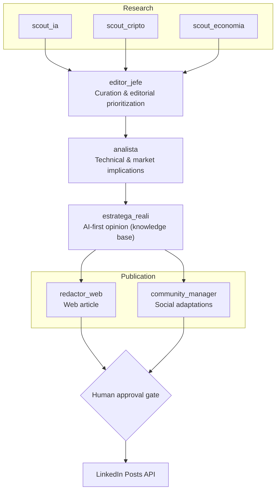

# thecrew — Autonomous AI News Intelligence Pipeline

A multi-agent newsroom built on [CrewAI](https://docs.crewai.com). Eight specialized agents find the day's most important story across three topics (AI, crypto, world economy), verify and analyze it, form an opinion through an AI-first lens, and produce publication-ready deliverables for web and social — with a human approval gate before anything goes out.

Runs on a weekly cron via GitHub Actions and publishes to LinkedIn through the official Posts API.

Stack: Python · CrewAI · LiteLLM · Anthropic Claude / OpenAI / Gemini · Serper · GitHub Actions · LinkedIn Posts API (OAuth 2.0)

---

## Architecture — 8-agent pipeline



| # | Agent | Role | Tools |
|---|-------|------|-------|
| 1–3 | `scout_*` | Topic-specific news hunting | `SerperDevTool`, `ScrapeWebsiteTool` |
| 4 | `editor_jefe` | Selects the #1 story per topic and prioritizes | reasoning only |
| 5 | `analista` | Analyzes implications | `ScrapeWebsiteTool` (source deep-dive) |
| 6 | `estratega_reali` | Objective AI-first opinion | `knowledge/` base |
| 7 | `redactor_web` | Web article | writing |
| 8 | `community_manager` | Social posts + visual brief | writing |

### Why this design

Splitting *research → curation → analysis → opinion → publication* into specialized agents outperforms a single monolithic prompt on output quality, but the real payoff is operational:

- **Per-stage model routing.** Scouts do high-volume search and summarization where a cheap, fast model is sufficient; analysis and opinion get the most capable model. Cost scales with the work that actually needs reasoning.
- **Clear intervention points.** Because each stage emits a discrete artifact, a human can inspect the pipeline at any boundary rather than debugging one opaque generation.
- **Irreversible actions are gated.** Publishing is the only step with real-world consequences, so it is deliberately excluded from automation.

---

## Multi-provider model routing

CrewAI reaches any LLM through **LiteLLM**, so model strings carry a provider prefix. Providers are swappable **by environment variable, without touching code**:

| Provider | Model string (example) | `.env` key |
|----------|------------------------|------------|
| Anthropic (default) | `anthropic/claude-opus-4-8`, `anthropic/claude-haiku-4-5` | `ANTHROPIC_API_KEY` |
| OpenAI | `openai/gpt-4o`, `openai/gpt-4o-mini` | `OPENAI_API_KEY` |
| Google | `gemini/gemini-2.0-flash`, `gemini/gemini-1.5-pro` | `GEMINI_API_KEY` |

Two independently configurable stages (`src/thecrew/crew.py`):

- **`RESEARCH_MODEL`** — the scouts (search + summarize). Good candidate for a cheaper, faster model.
- **`WRITER_MODEL`** — analysis, AI-first opinion and drafting. Use the most capable model available.

Unset, both stages fall back to `anthropic/claude-opus-4-8`. Verify exact OpenAI/Gemini model IDs against the LiteLLM docs before pinning them.

---

## Tools and extensibility

- **Search / scraping:** `SerperDevTool` (needs `SERPER_API_KEY`) and `ScrapeWebsiteTool` for same-day research.
- **Publishing:** custom tools in `tools/publishing_tools.py` persist the article and posts as files, ready to wire into a CMS or an external API.
- **MCP (scaffolded, not active):** `crew.py` ships the `MCPServerAdapter` pattern from `crewai-tools` as a commented block, so MCP servers — a Notion server for publishing, a social-media server — can be exposed as native agent tools. **This path is prepared, not currently wired in.**

---

## Setup

```bash
# 1. Install (Python 3.10–3.13; uv recommended by CrewAI)
pip install uv
uv sync                 # or: pip install -e .

# 2. Credentials
cp .env.example .env    # fill in ANTHROPIC_API_KEY and SERPER_API_KEY

# 3. Run — explicit trigger, no silent default
uv run run_dia          # top story of the last 24 hours (on-demand)
uv run run_semana       # top story of the last 7 days (weekly run)
```

Deliverables land in `output/`:
- `output/articulo_web.md` — web article
- `output/redes_sociales.md` — LinkedIn, X and Instagram posts

---

## Automation (GitHub Actions)

`.github/workflows/semanal.yml` runs `run_semana` every **Monday at 13:00 UTC** (≈ 09:00 Chile) plus manual `workflow_dispatch`, and uploads `output/` as an artifact.

```bash
gh secret set ANTHROPIC_API_KEY --repo <owner>/thecrew
gh secret set SERPER_API_KEY    --repo <owner>/thecrew
```

The cron **generates**; it does not publish. Publication is a separate, reviewed step by design.

---

## LinkedIn publishing

`uv run publicar_linkedin` extracts the `## LinkedIn` block from `output/redes_sociales.md` and posts it via the Posts API.

```bash
uv run publicar_linkedin              # PREVIEW only (default)
uv run publicar_linkedin --publicar   # actually publish
```

**Preview-by-default is intentional**: publishing is irreversible, so the destructive path requires an explicit flag and is never reachable from the cron.

**Images.** Drop a file at `imagenes/YYYY-MM-DD.png` (or `.jpg`) and the script attaches it with accessible alt text derived from the post's first line (`--alt "..."` to override, `--imagen path.png` for a different file). The pipeline also *suggests what image to create*: the `adaptacion_redes` task emits a `## Imagen sugerida` section with a visual brief and alt text. Preview reports whether an image was found; without one it posts text only.

```bash
uv run run_dia                        # 1) generate
# 2) drop imagenes/YYYY-MM-DD.png
uv run publicar_linkedin              # 3) preview: confirm text + image
uv run publicar_linkedin --publicar   # 4) publish
```

### Publishing as a company page

```bash
uv run publicar_linkedin --empresa              # preview as company
uv run publicar_linkedin --publicar --empresa   # publish to the page
```

Requires being a page **admin**, enabling the **Community Management API** product (grants `w_organization_social` and `rw_organization_admin`, subject to approval), and regenerating the token with `uv run linkedin_token --empresa`. The organization URN resolves automatically; pin `LINKEDIN_ORG_URN` in `.env` if you administer several pages.

<details>
<summary><b>Getting the OAuth token (one-time setup)</b></summary>

1. Create an app at [LinkedIn Developers](https://www.linkedin.com/developers/apps) and associate it with a company page.
2. Add the **"Share on LinkedIn"** and **"Sign In with LinkedIn using OpenID Connect"** products to enable the `w_member_social` and `openid`/`profile` scopes.
3. Under **Auth → Authorized redirect URLs**, add exactly: `http://localhost:8765/callback`.
4. Put `LINKEDIN_CLIENT_ID` and `LINKEDIN_CLIENT_SECRET` in `.env`.
5. Run the helper — it opens a browser, you authorize, and it writes the token to `.env`:
   ```bash
   uv run linkedin_token
   ```

Client ID and secret alone are **not** enough: a publishing token requires member authorization via 3-legged OAuth, which is exactly what this step performs. Member tokens expire (~60 days); the refresh token is stored if the app enables it. `LINKEDIN_AUTHOR_URN` is optional — it resolves through `/v2/userinfo`.

</details>

---

## Customization

| What | Where |
|---|---|
| Topics | `src/thecrew/main.py` → `topics` |
| AI-first voice and criteria | `knowledge/reali_ai_first_lens.md` |
| Editorial rules (objectivity, format) | `knowledge/editorial_guidelines.md` |
| Agent roles / goals / backstories | `src/thecrew/config/agents.yaml` |
| Task instructions and outputs | `src/thecrew/config/tasks.yaml` |

---

## Status

Running end to end with live credentials.

- [x] Standard CrewAI structure (YAML config + `crew.py` + `main.py`)
- [x] 8 agents and 8 chained tasks
- [x] Multi-provider LLM routing via LiteLLM, two independently configurable stages
- [x] Search tools + publishing tools + MCP adapter pattern scaffolded
- [x] Live credentials connected, validation runs completed (daily + weekly)
- [x] Weekly automation via GitHub Actions (cron + artifact)
- [x] LinkedIn publishing (`publicar_linkedin`, preview-by-default, OAuth 2.0)
- [ ] Additional channels (web CMS / X / Instagram)
- [ ] MCP adapter activated beyond the scaffolded pattern

## Known limitations

- **No automated output evaluation.** Editorial quality is currently judged by human review at the approval gate. A regression suite scoring factuality against retrieved sources is the clearest next improvement.
- **Single-pass pipeline.** Agents do not currently re-plan or retry on weak upstream output; a bad scout result propagates downstream.
- **Source diversity depends on Serper ranking.** No independent verification layer beyond the analyst's source deep-dive.

---

Built by [Nichelson Churata](https://www.linkedin.com/in/nichelsonsilver)
